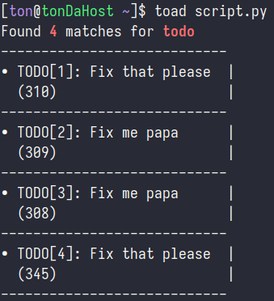

# Toad
Parse TODO patterns inside a source file.



## Installation
```console
$ git clone https://github.com/Tontuu/toad.git && toad
$ pip install colorama
$ chmod +x toad
$ sudo ln -s /path/to/script/toad /usr/local/bin # Add to your preferred path
```

## Usage
```console
toad file [OPTIONS...]
```

### Some examples
```sh
# Help message
toad -h

# Print all the matches for default pattern [todo]
toad script.rs

# Specifies the output file for to-dos
toad script.rs -o my_todos.md

# Delete all to-dos inside the given file
toad script.rs -d "todo"
```
